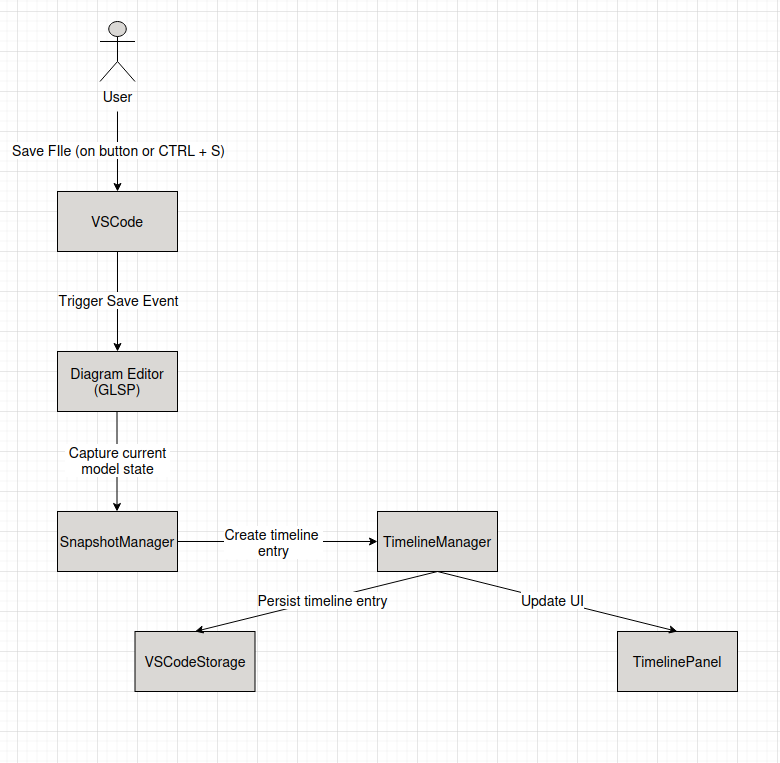
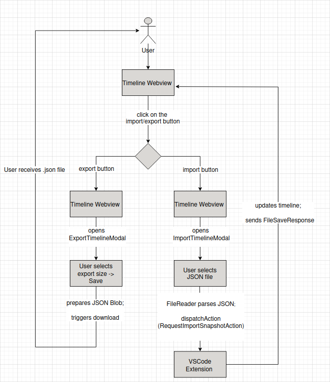

# Revision Management

The Revision Management (Timeline) feature helps users track and manage changes in the web modeling tool. It automatically records modifications, creating a history of updates that users can review, navigate, and restore if needed. When a file is saved, or when a manual saving action is triggered, a timeline entry is added to the history. This allows the user to see how the model evolves over time, to keep track of and compare different versions, and revert to previous states when necessary. This provides a safety net for experimentation without the risk of losing important work.

[insert demo gif here]

## System Overview

The Revision Management Feature is structured as a two-part extension inside the BigUML system environment:

- **Frontend (Webview):**  
  It is defined using React and  it provides the user interface for interacting with the timeline. Users can create, view, rename, delete, import, and export timeline entries. It communicates with the backend via a lightweight action-dispatch mechanism and renders SVG previews of model snapshots.

- **Backend (VSCode Extension):**  
  Implemented in TypeScript, it handles snapshot generation, persistence, and communication with the modeling infrastructure (GLSP and underlying model state). It listens for file system changes (e.g. UML save events), manages snapshot storage per model, and dispatches updates back to the frontend.

Each time a `.uml` file is saved, a snapshot of the current model state is created, stored, and visually represented on the timeline. Timeline entries include metadata such as timestamp and a minimap (SVG) rendering of the model at that moment. Snapshots can be exported to or imported from JSON files, which allows users to archive and restore entire revision histories. Timeline data is stored per diagram using VSCode's `globalState`, ensuring persistence across sessions.

## Features

### Timeline Core Features

- **Add timline entry automatically on save** 
    - Precondition: Diagram open
    - User action: Save file (CTRL+S or via VSCode auto-save)
    - Result: New timeline entry added ("File Saved") in Timeline window
- **Add timeline entry manually**
    - Precondition: Diagram & Timeline open
    - User action: In Timeline, click on "Create new timeline entry"
    - Result: New timeline entry added ("Manual Save") in Timeline window
- **View timeline (history)**
    - Precondition: Diagram open, Timeline is not empty
    - User action: Open Timeline
    - Result: List of previously added timeline entries (history) in Timeline window
- **View timeline entry (model state)**
    - Precondition: Diagram & Timeline open, Timeline is not empty
    - User action: Click on a timeline entry
    - Result: Diagram for the selected timeline entry is displayed ("Minimap")
- **Rename timeline entry**
    - Precondition: Diagram & Timeline open, Timeline is not empty
    - User action: In Timeline, click on the edit icon (pencil) of an entry, edit the name, click on the save icon
    - Result: Selected timeline entry is renamed
- **Delete timeline entry**
    - Precondition: Diagram & Timeline open, Timeline is not empty
    - User action: In Timeline, click on the delete icon (trash can) of an entry, confirm the deletion in the dialog
    - Result: Selected timeline entry is deleted
- **Restore timeline**
    - Precondition: Diagram & Timeline open, Timeline is not empty
    - User action: In Timeline, click on the entry to be restored, click restore
    - Result: Selected timeline entry is restored (**Attention**: The diagram must be re-opened to see the update - see chapter "Limitations" below!), history is cropped (all entries newer than the restored entry are deleted)

### Integration

- **Persistence**
    - Precondition: Diagram & Timeline open, Timeline is not empty
    - User action: Close VSCode and re-open
    - Result: The timeline is automatically persisted on the user's device (localStorage), and still contains the previously added entries
- **Per-diagram timeline**
    - Precondition: Two diagrams open, both with non-empty timelines
    - User action: Switch between diagrams
    - Result: Timeline changes per diagram

### Import/Export

- **Export timeline (history)**
    - Precondition: Diagram & Timeline open, Timeline is not empty
    - User action: Click "export" (top-right of timeline, cloud with downwards arrow), in dialog select "entire timeline" or "last n entries", click export, choose file location
    - Result: Timeline exported as JSON to selected location
- **Import timeline (history)**
    - Precondition: Diagram & Timeline open, Timeline is empty
    - User action: Click "import" (top-right of timeline, cloud with upwards arrow), in dialog select an import JSON file (e.g., previous export), select "entire timeline" or "last n entries", click import
    - Result: Timeline imported (contains imported entries)
- **Export single model state (SVG)**
    - Precondition: Diagram & Timeline open, Timeline is not empty
    - User action: Click on a timeline entry, click on "Export Snapshot", choose a file location
    - Result: SVG export of the selected timeline entry is saved to the selected location

# Course Documentation

## Workflows

### Save-triggered Timeline Entry Workflow

### Import and Export of Timeline Snapshots Workflow

## Development Process

We began by creating mockups of the key features to explore the user interface and define the visual structure of the package. Once we finalized the design, we focused on implementing the UI in VSCode using mocked data. This allowed us to render the timeline view and integrate modals for import and export without yet connecting any logic.

With the UI foundation in place, we moved to an incremental, feature-driven implementation. Our first priority was the core functionality of the Revision Management package: capturing timeline entries. We ensured that a new entry is automatically added when a `.uml` file is saved (via `Ctrl+S` or `auto-save`), and also enabled manual creation of entries through a dedicated button.

Next, we implemented rendering of minimaps for each timeline entry. For this, we used the existing `MiniMap` package to display snapshots of model states. Following that, we added functionality for importing and exporting timeline entries as JSON or exporting a single timeline entry as SVG, enabling users to save and reuse their revision history. We then introduced the ability to rename existing timeline entries to improve traceability. Aftwerwards, we also enabled deleting singular timeline entries.

To ensure that timeline snapshots persist across sessions, we used **VSCode's global storage** as a simple and effective way to retain timeline entries even when the BigUML extension is restarted.

We completed the core feature set by implementing deletion of timeline entries. This allows users to manage their revision history more effectively by removing outdated or unnecessary snapshots. In file `big-revision-management/vscode/revision-management.provider.ts`, there is a helper function called `clearVSCodeStorage()` which, during development, is executed automatically on each session load to clear the stored timeline entries. This was useful for testing a clean state but conflicts with persistence testing. Unfortunately, due to TypeScript compiler constraints, we were unable to simply comment out the function or leave it unused—both options resulted in a build error (either from an unused method or an invalid comment syntax depending on placement).

As a result, we chose to leave the method defined and invoked by default for simplicity during development and debugging. If you wish to test the persistence behavior of timeline entries, simply **comment out line 51** (the call to `clearVSCodeStorage()`) in `revision-management.provider.ts`.

## Encountered Problems

One of the main challenges we faced during development was navigating the complexity of the BigUML project itself. Since we joined the project without prior experience in its architecture, we needed to invest time into understanding its structure, communication patterns, and extension points.

BigUML is a large and modular system with many interconnected parts, which made it initially overwhelming. As we are not model engineering experts—and especially not familiar with developing VSCode extensions—everything from the tooling to the conceptual model was new territory for us. Understanding how the underlying model state is managed, how different layers communicate, and where our extension logic fits in required deep exploration.

A particular learning curve was working with the action system. At first, it wasn’t clear how actions were dispatched, how responses were handled, or how existing components (like the minimap rendering logic) could be reused. We had to carefully inspect and trace existing code to understand how to integrate our own functionality into the system without breaking existing behavior.

Despite the challenges, this exploration turned out to be an important learning experience, as it taught us how to extend and reuse complex infrastructure in a structured way.

## Limitations / Implementation Gaps

The core functionality of the Revision Management feature is working as intended, but there are still several limitations and implementation gaps that remain due to the current scope of the project.

The most significant limitation is that **restoring a timeline entry does not yet update the main model in the editor view**. Although the restoration logic updates the internal timeline state and persists it correctly, the actual synchronization with the diagram on the main screen requires additional server-side logic. This functionality is expected to be implemented by the lecture team as part of the backend extension for which we also added `TODO` comments on desired places. This functionallity should bbe also implemented if for example the last entry in the timeline gets deleted  or if a complitely new timeline gets imported.

Another gap lies in the **importing of timeline entries**. Currently, the system does not validate the structure or contents of the imported JSON file. As a result, if a user selects an invalid or incorrectly formatted file, the import may silently fail or lead to inconsistent timeline state. At this stage, we expect users to import only JSON files that were previously exported using our own export functionality. Proper validation and error feedback would need to be implemented to make this feature more robust and user-friendly.

These limitations do not affect the use of the extension under normal conditions but should be addressed in future iterations to improve reliability and completeness.

## Future Work

As proposed in the previous section on limitations and implementation gaps, two main focuses for future development are:

1. **Updating the main model view based on timeline actions** – This synchronization is needed for making the timeline fully functional as a revision control tool. Server-side support for state restoration will be needed to enable this.

2. **Validation of imported timeline files** – To make the system more robust and user-friendly, future versions should validate the structure of imported data and notify the user if the format is incorrect or incomplete. Ideally, users should only import files previously exported through the Revision Management package itself, and this expectation should be made explicit in the UI.

In addition to these core improvements, we thought of several enhancements and new features that could improve the user experience and help evolve the timeline into a comprehensive revision management tool—particularly in collaborative environments where multiple users work on the same project:

* **Git Integration**: Linking timeline entries to Git commits or branches would provide a powerful bridge between visual modeling and code version control. This could include displaying commit messages, comparing diagram states with corresponding differences, the creator of the commit, or restoring a model to match a specific commit.

* **Timeline Diffing**: Enabling users to compare two timeline entries side-by-side—visually or structurally—would offer insights into how the model evolved. This could help identify unintended changes or document design progress.

* **Tagging, Comments, and Annotations**: Allowing users to tag entries (e.g., “milestone”, “draft”, “approved”) or leave short comments would improve traceability and collaboration in team settings.

* **Search and Filtering**: As timelines grow longer, adding support for keyword-based search or filters (e.g. by date, tag, or author) would help users quickly locate relevant snapshots.

* **Collaborative Editing Awareness**: In multi-user environments, it could be useful to display simultaneous activity indicators.

## Feedback

### BigUML Feedback

### Course Feedback

